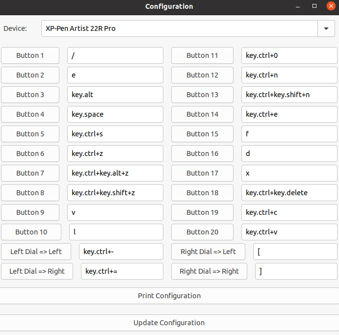

# Kuri's XP-Pen Userland config utility (GUI)



Very rudimentary at the moment and only supports the Artist 22R Pro for now.
Pressing the update button will send the SIGHUP signal to the actual driver and get it to reload the config.

Setup with:
```
pip install -r requirements.txt
python3 main.py
```